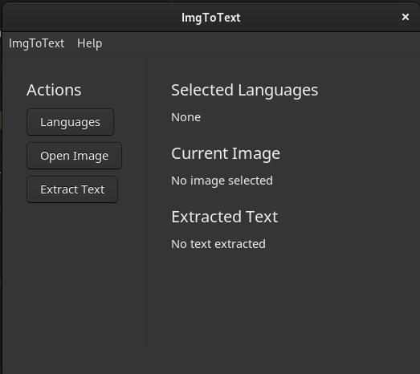
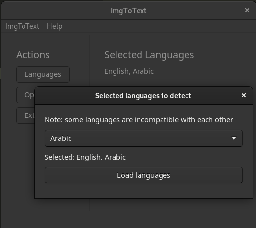
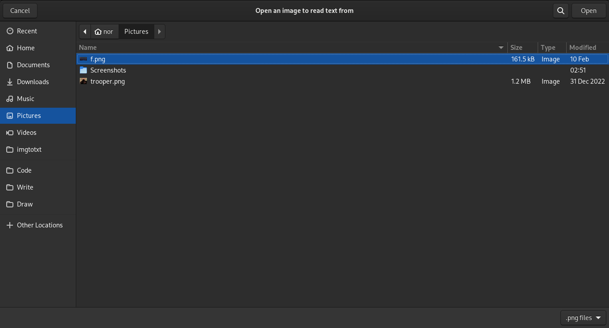
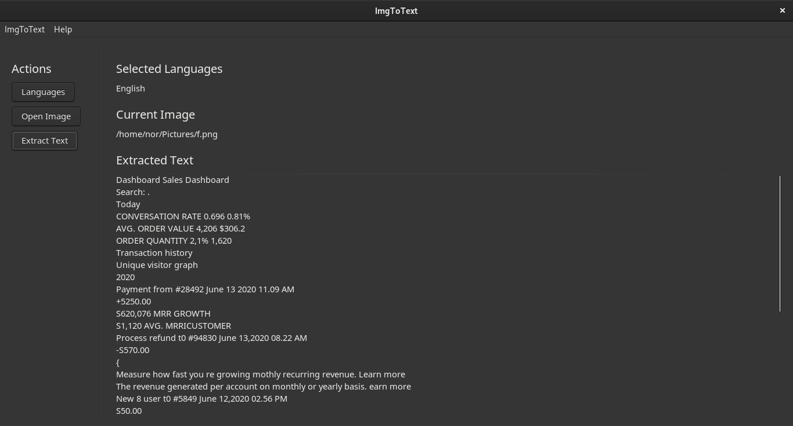

# ImgToTxt

Native python OCR app running locally to extract text from your images. It provides a native look and feel, and downloads the models for recognition of text to use without any remote connection.

Made with great libraries: 
- [EasyOCR](https://github.com/JaidedAI/EasyOCR) (OCR Models and Code)
- [Toga](https://github.com/beeware/toga) (User Interface)


## Installation
Must have Python, Pip, and Git installed.
- Clone and enter directory:
  ```bash
  git clone --depth=1 https://github.com/ahmeddots/imgtotxt && cd imgtotxt
  ```
- Install all requirements:
  ```bash
  pip install -r requirements.txt
  ```
- Run the app (only need to repeat this step next time):
  ```bash
  python -m imgtotxt
  ```

## Usage

- You will be greeted with three actions, and three sections for preview.

  
  
- By clicking on "Languages", you will be presented with a window to select languages in. Note that the selection element works a bit strangely - any time you select an item, it'll be added to the list, and if you select it again it will be removed from the list. Sadly, there doesn't seem to be a multi-select element in Toga.
- After selecting the desired languages, click on "Load languages", but be patient since loading languages might take some time at first as they'll be downloaded.

  
  
- Next, you must click on "Open Image" to select an image from your storage. The image path will display under the "Current Image" section.
  
  
  
- Finally and obviously, click on "Extract Text", and after some waiting (depending on your specs) the text will display under the "Extracted Text" section.
  
  

